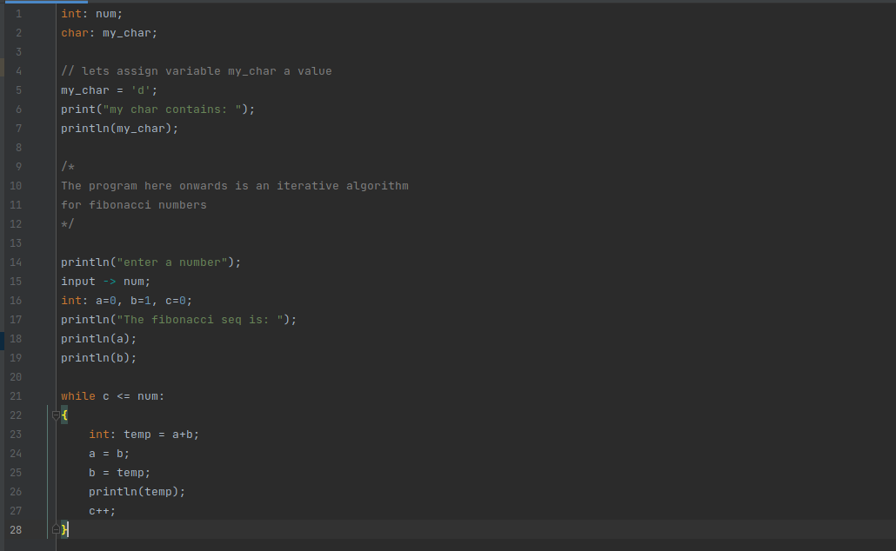
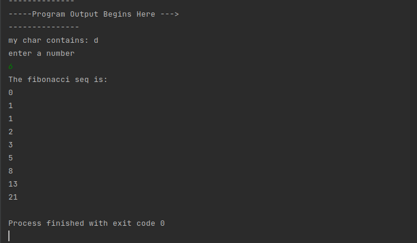

# Panda Compiler
## A Compiler for CC language. 

[](https://github.com/AsjadIftikhar/PandaCompiler.git)

Panda Compiler is a Java based compiler for an imaginary language CC(Compiler Construction). 
It is created in Compiler Construction Course during Fall 2021 by

- Asjad Iftikhar
- Tayyab Waseem

## Features

- Lexical Analyzer
- Parser
- Translator
- Virtual Machine
- Design

Concepts used to create the compiler were learned from the following book:
- [Dragon Book Compilers Principle Techniques and Tools 2nd Edtion](http://ce.sharif.edu/courses/94-95/1/ce414-2/resources/root/Text%20Books/Compiler%20Design/Alfred%20V.%20Aho,%20Monica%20S.%20Lam,%20Ravi%20Sethi,%20Jeffrey%20D.%20Ullman-Compilers%20-%20Principles,%20Techniques,%20and%20Tools-Pearson_Addison%20Wesley%20(2006).pdf)

## Design
You can find the details of design of each phase of compiler including DFA, Regular Expressions etc in the [Design](https://github.com/AsjadIftikhar/PandaCompiler/tree/main/Design) Folder.
It also contains the detailed description of the syntax for our CC language

## A sample Code in CC Language
- A program to print fibonacci numbers until a given number



## Output of the above program
- Output of the program looks like this:



## Installation

Panda Compiler requires [Java 17](https://www.oracle.com/java/technologies/javase/jdk17-archive-downloads.html) to run.

Step 1.

```sh
Initialize an empty Java Project in any IDE like Intellij IDEA or NetBeans
```

Step 2.

```sh
Replace src folder
```

Step 3.

```sh
Place the source code with .cc extension in the same folder as src
```

Step 4.

```sh
Execute code
```

Good Luck! Have a nice day.

